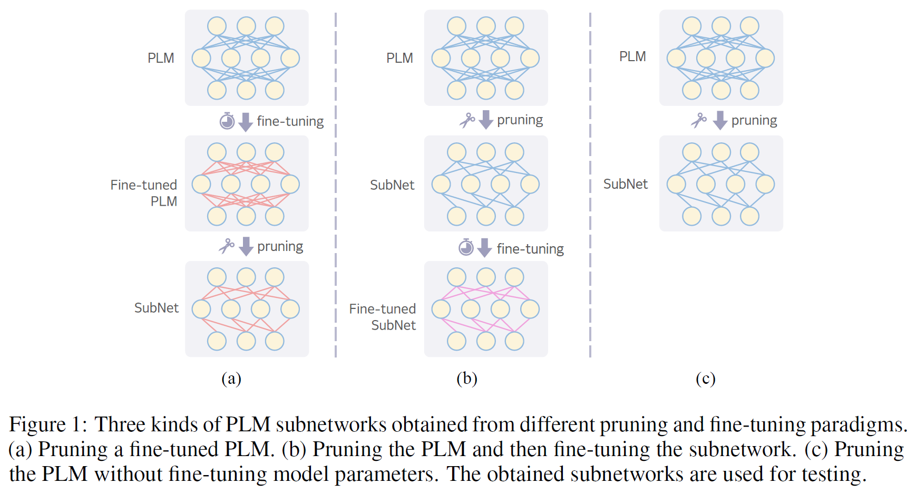

# A Win-win Deal: Towards Sparse and Robust Pre-trained Language Models

This repository contains implementation of the [paper](https://arxiv.org/abs/2204.11218) "A Win-win Deal: Towards Sparse and Robust Pre-trained Language Models" (accepted by NeruIPS 2022).

The codes for debiasing methods are modified from [chrisc36/debias](https://github.com/chrisc36/debias) and [UKPLab/emnlp2020-debiasing-unknown](https://github.com/UKPLab/emnlp2020-debiasing-unknown). The codes for mask training are modified from [maskbert](https://github.com/ptlmasking/maskbert).

## Overview
The main topic of this paper is to investigate **whether there exist PLM subnetworks that are both sparse and robust against dataset bias?**

We call such subnetworks **SRNets** and explore their existence under different pruning and fine-tuning paradigms, which are illustrated in Figure1.




## Setup
```
  conda create -n srnet python=3.6
  conda activate srnet
  conda install pytorch==1.6.0 cudatoolkit=10.1 -c pytorch
  pip install -r requirements.txt
```
pytorch>=1.4.0 are also okay. <br />


## Prepare Data and Pre-trained Language Models
MNLI and QQP are datasets from the [GLUE](https://gluebenchmark.com/) benchmark. For FEVER, we use the processed [training](https://www.dropbox.com/s/v1a0depfg7jp90f/fever.train.jsonl) and [evaluation](https://www.dropbox.com/s/bdwf46sa2gcuf6j/fever.dev.jsonl) data provided by the authors of [FEVER-Symmetric](https://github.com/TalSchuster/FeverSymmetric). The OOD datasets can be accessed from: [HANS](https://github.com/tommccoy1/hans), [PAWS](https://github.com/google-research-datasets/paws) and [FEVER-Symmetric](https://github.com/TalSchuster/FeverSymmetric). Download the datasets and place them to the `data/` folder, the structure of which is like follows:
```
data
├── MNLI
│   ├── train.tsv
│   ├── dev_matched.tsv
│   ├── dev_mismatched.tsv
|   └── hans
|       ├── heuristics_train_set.txt
|       └── heuristics_evaluation_set.txt
├── QQP
│   ├── train.tsv
│   ├── dev.tsv
|   ├── paws_qqp
|   |   ├── train.tsv
|   |   ├── dev.tsv
|   |   └── test.tsv
|   └── paws_wiki
|       ├── train.tsv
|       ├── dev.tsv
|       └── test.tsv
└── fever
    ├── fever.train.jsonl
    ├── fever.dev.jsonl
    ├── sym1
    |   └── test.jsonl
    └── sym2
        ├── dev.jsonl
        └── test.jsonl

```

By specifying the argument `--model_name_or_path` as `bert-base-uncased`, `bert-large-uncased` or `roberta-base`, the code will automatically download the PLMs. You can also manually download the models from [huggingface models](https://huggingface.co/models) and set `--model_name_or_path` as the path to the model checkpoints.


## Fine-tuning Full BERT

### <span id="std_full_ft"> Fine-tuning with Standard Cross-Entropy (CE) Loss </span>
To fine-tune full BERT with standard cross-entropy loss, use the scripts in `scripts/full_bert/std_train`. Taking MNLI as an example, run
```
  bash scripts/full_bert/std_train/mnli.sh
```

### Fine-tuning with Debiasing Loss
The debiasing methods requires the bias models, which are trained using the codes provided by [chrisc36/debias]([https://github.com/chrisc36/debias](https://github.com/chrisc36/debias/tree/master/debias/preprocessing)). The predictions of the bias models are placed in the folder `bias_model_preds`. 

To fine-tune full BERT with *Product-of-Experts(PoE)* on MNLI, run
```
  bash scripts/full_bert/robust_train/poe/mnli.sh
```
Changing `poe` to `reweighting` or `conf_reg` to switch to *Example Reweighting* or *Confidence Regularization*. 

Note that to perform `conf_reg`, we need to first fine-tune BERT with standard CE loss (the teacher model) and obtain the predictions.


## Subnetworks from Fine-tuned BERT

### Subnetworks from Standard Fine-tuned BERT
#### IMP
To perform IMP using the CE loss on a standard fine-tuned BERT (again, taking MNLI as example), run
```
  bash scripts/imp/prune_after_ft/std/mnli.sh
```
Note that IMP will produce subnetworks with varying sparsity levels (10%~90%). 

Similarly, when PoE is used in the process of IMP, run
```
  bash scripts/imp/prune_after_ft/poe/mnli.sh
```

#### <span id="mask_train1"> Mask Training </span>
To perform mask training using the CE loss, with a target sparsity of 50%, run
```
  bash scripts/mask_train/mask_on_plm_ft/plm_std_ft/std/mnli/0.5.sh
```
Similarly, to use the PoE loss, run
```
  bash scripts/mask_train/mask_on_plm_ft/plm_std_ft/poe/mnli/0.5.sh
```

### Subnetworks from PoE Fine-tuned BERT
#### IMP
To perform IMP using the PoE loss on a PoE fine-tuned BERT, run
```
  bash scripts/imp/prune_after_robust_ft/poe/mnli.sh
```

#### Mask Training
To perform mask training using the PoE loss, with a target sparsity of 50%, run
```
  bash scripts/mask_train/mask_on_plm_ft/plm_poe_ft/poe/mnli/0.5.sh
```

## BERT Subnetworks Fine-tuned in Isolation
### IMP
To obtain the subnetworks using IMP, run
```
  bash scripts/imp/lt/pruning/mnli.sh
```
This will produce subnetworks with varying sparsity levels (10%~90%). Then, fine-tune the obtained subnetwork (taking 50% sparsity as an example) by running:
```
  bash scripts/imp/lt/retrain/std/mnli/0.5.sh
```
Change the shell script to `scripts/imp/lt/retrain/poe/mnli/0.5.sh` to enable PoE fine-tuning.

### Mask Training
We use the pruning masks of the [Subnetworks from Standard Fine-tuned BERT](#mask_train1). Then, fine-tune the obtained subnetwork by running:
```
  bash scripts/mask_train/mask_on_plm_ft/plm_std_ft/poe/mnli/retrain/std/0.5.sh
```
Change the shell script to `scripts/mask_train/mask_on_plm_ft/plm_std_ft/poe/mnli/retrain/poe/0.5.sh` to enable PoE fine-tuning.


## BERT Subnetworks Without Fine-tuning
To obtain the subnetworks, directly performing mask training on the pre-trained BERT:
```
  bash scripts/mask_train/mask_on_plm_pt/std/mnli/0.5.sh
```
To enable mask training with PoE, change the shell script to `scripts/mask_train/mask_on_plm_pt/poe/mnli/0.5.sh`.


## Sparse and Unbiased BERT Subnetworks
We utilize the OOD training data to explore the upper bound of SRNets. The above three setups are considered and we give examples as follows

**Subnetworks from Fine-tuned BERT**:
```
  bash scripts/mask_train/mask_on_plm_ft/plm_std_ft/ood/mnli/0.5.sh
```
**BERT Subnetworks Fine-tuned in Isolation**:
```
  bash scripts/mask_train/mask_on_plm_ft/plm_std_ft/ood/mnli/retrain/0.5.sh
```
**BERT Subnetworks Without Fine-tuning**:
```
  bash scripts/mask_train/mask_on_plm_pt/ood/mnli/0.5.sh
```

## Refining the SRNets Searching Process
### The Timing to Start Searching SRNets
To start mask training from a [standard full BERT](#std_full_ft) fine-tuned for 5000 steps, run
```
  bash scripts/mask_train/mask_on_plm_ft/plm_std_ft/poe/mnli/mask_on_checkpoints/5000.sh
```
The sparsity of subnetworks are set to 70% by default.

### Gradual Sparsity Increase
To perform mask training with gradual sparsity increase, run the following command:
```
  bash scripts/mask_train/mask_on_plm_ft/plm_std_ft/poe/mnli/gradual_sparsity_increase/0.9.sh
```
The initial and final sparsity levels can be set in the script, corresponding to the arguments `--init_sparsity` and `--zero_rate`, respectively.
